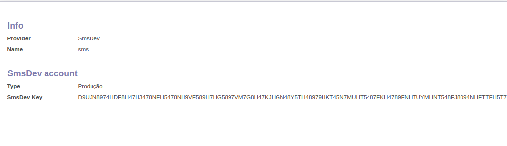

To configure this module, you need to:

#. Access: https://painel.smsdev.com.br/login

#. Create account

#. Get Chave Key

#. In odoo:

* Go to IAP menu
* Create a new account with sms_dev as provider
* Fill your name information with "sms"
* Fill Type as Produção
* Fill SmsDev Key
* You can now send an sms

