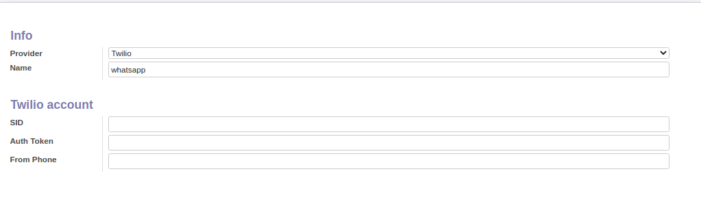

To configure this module, you need to:

#. Access: https://www.twilio.com/

#. Create account

#. Get credentials

#. In odoo:

* Go to IAP menu
* Create a new account with twilio as provider
* Fill your account information
* You can now send an sms or whatsapp

